# Relatório Técnico — Agente Inteligente em Labirinto

> Reprodutibilidade: `python -m venv .venv && .venv/bin/pip install -r requirements.txt`,
> depois `experimentos.py` (Parte II), `experimentos_local.py` (Parte III) e
> `experimentos_online.py <mapa>` (Parte IV). O uso de IA generativa está
> declarado em `uso_ia.md`.

## Sumário
1. [Visão geral](#1-visão-geral)
2. [Parte I — Projeto do agente (PEAS)](#2-parte-i--projeto-do-agente)
3. [Parte II — Busca clássica](#3-parte-ii--busca-clássica)
4. [Parte III — Busca local com pontos de coleta](#4-parte-iii--busca-local)
5. [Parte IV — Busca online](#5-parte-iv--busca-online)
6. [Conclusão comparativa](#6-conclusão-comparativa)

---

## 1. Visão geral

O objetivo é um agente que resolve labirintos em grade sob três condições, no
mesmo domínio: **mapa conhecido** (A → B), **múltiplos pontos de coleta**
(visitar todos os C antes de B) e **mapa desconhecido** (explorar enquanto se
move). 

A legenda dos mapas é: `#` parede, `` célula livre (custo 1), `~` lama (custo 3), `A` início, `B` objetivo, `C` ponto de coleta, `?` célula desconhecida (modo online). 

O terreno de lama foi acrescentado para que os custos variem e a comparação entre algoritmos sensíveis a custo (UCS, A*) e sensíveis a passos (BFS) fique evidente.

## 2. Parte I - Projeto do agente

### 2.1 Modelagem PEAS
- **Performance:** J = −α·custo do caminho − β·nós expandidos − γ·tempo de
  execução − δ·movimentos inválidos − ε·células revisitadas. Todos os termos são
  penalizações; quanto maior J, melhor o agente.

- **Environment:** labirinto em grade, discreto, com células livres, lama,
  paredes, início, objetivo, pontos de coleta e regiões desconhecidas no modo
  online. É **totalmente observável** na busca clássica e **parcialmente
  observável** no modo online; **determinístico**, **estático**, **discreto** e
  de **agente único**.

- **Actuators:** movimentos ortogonais A = {cima, baixo, esquerda, direita}.

- **Sensors:** mapa inteiro (busca clássica) ou vizinhança local de raio 1
  (modo online).

### 2.2 Classificação do agente
**Agente baseado em objetivos com modelo interno** (mínimo exigido): persegue o
objetivo B e, no modo online, mantém e atualiza um modelo interno do mapa.

## 3. Parte II — Busca clássica

### 3.1 Formulação formal
Problema = ⟨S, A, T, s₀, G, c⟩:

- **S:** posições livres (estado = (linha, coluna));
- **A:** ações ortogonais;
- **T:** vizinhos válidos (dentro da grade e sem parede);
- **s₀:** célula A; 
- **G:** estado == B; 
- **c:** custo de entrar na célula de destino
(1 livre, 3 lama). 
- **Heurística das buscas informadas:** distância de Manhattan,

### 3.2 Resultados
2 mapas: `exemplo.txt` (o mapa do enunciado, de **custo uniforme** — todos os
algoritmos completos acham o ótimo) e `armadilha_gulosa.txt` (corredor reto de
lama, curto em passos e caro, com um desvio livre ao lado).

**Mapa `exemplo.txt`:**

```text
###########
#A   #    #
# ## # ## #
#    C   B#
# ##   #  #
#   C  #  #
###########
```

| Algoritmo | Sucesso | Custo | Passos | Expandidos | Tempo (ms) | Fronteira |
|-----------|:-------:|:-----:|:------:|:----------:|:----------:|:---------:|
| BFS       | sim | 10 | 10 | 28 | 0.080 | 4 |
| DFS       | sim | 18 | 18 | 22 | 0.061 | 7 |
| UCS       | sim | 10 | 10 | 28 | 0.087 | 4 |
| Gulosa    | sim | 10 | 10 | 10 | 0.035 | 9 |
| A*        | sim | 10 | 10 | 14 | 0.050 | 7 |

**Mapa `armadilha_gulosa.txt`:**

```text
##########
#A~~~~~~B#
#        #
##########
```

| Algoritmo | Sucesso | Custo | Passos | Expandidos | Tempo (ms) | Fronteira |
|-----------|:-------:|:-----:|:------:|:----------:|:----------:|:---------:|
| BFS       | sim | 19 | 7  | 14 | 0.050 | 2 |
| DFS       | sim | 19 | 11 | 11 | 0.036 | 5 |
| UCS       | sim | 9  | 9  | 14 | 0.049 | 4 |
| Gulosa    | sim | 19 | 7  | 7  | 0.026 | 8 |
| A*        | sim | 9  | 9  | 10 | 0.038 | 6 |

### 3.3 Análise (seção 5.4)
Nas figuras: hachura azul = **células exploradas**, linha vermelha = **caminho devolvido**, bege = **lama** (`~`). Cada item mostra o algoritmo nos dois mapas — `exemplo` (custo uniforme) à esquerda e `armadilha_gulosa` à direita.

**1. BFS — ótima em passos, não em custo.** Acha sempre o caminho com **menos passos**; só é ótima em custo quando os movimentos custam o mesmo (coincide no `exemplo`, falha no `armadilha`: 19 vs 9).

<p align="center">
  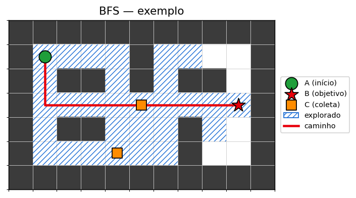
  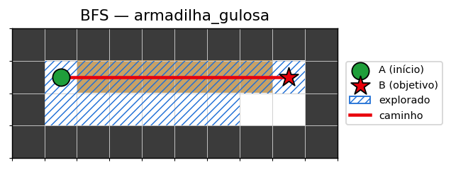
</p>

GIFs:
[(exemplo)](figuras/parte2/exemplo_BFS.gif) · [(armadilha)](figuras/parte2/armadilha_gulosa_BFS.gif)

**2. DFS — rápida, mas subótima.** Economiza memória (fronteira pequena), mas a qualidade não é garantida: é subótima nos dois mapas (custo 18 vs 10 no `exemplo`, 19 vs 9 no `armadilha`).

<p align="center">
  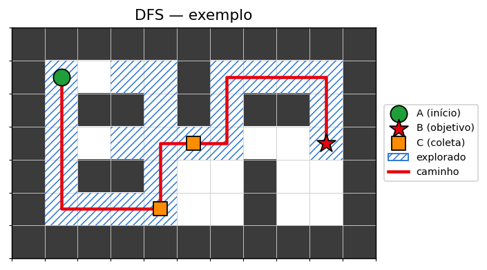
  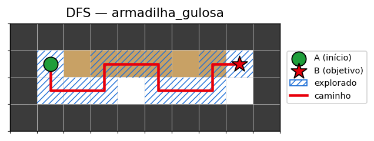
</p>

GIFs:
[(exemplo)](figuras/parte2/exemplo_DFS.gif) · [(armadilha)](figuras/parte2/armadilha_gulosa_DFS.gif)

**3. UCS ≠ BFS sob custo variável.** Quando os custos variam, as duas divergem: com a lama, a UCS achou **9** (contornando) e a BFS achou **19** (reto). É o par visual com a figura da BFS acima.

<p align="center">
  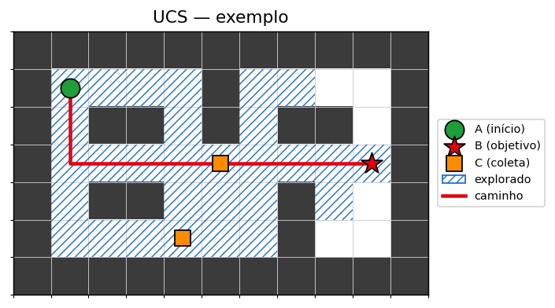
  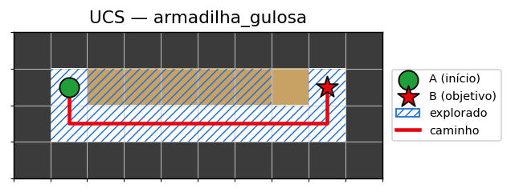
</p>

GIFs:
[(exemplo)](figuras/parte2/exemplo_UCS.gif) · [(armadilha)](figuras/parte2/armadilha_gulosa_UCS.gif)

**4. Gulosa — eficiente, porém enganável.** Expande pouquíssimos nós (corre na direção de `h`), mas pode ser subótima: ignora o custo já gasto e entra na lama (19 vs 9).

<p align="center">
  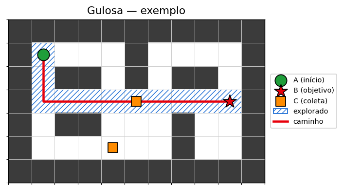
  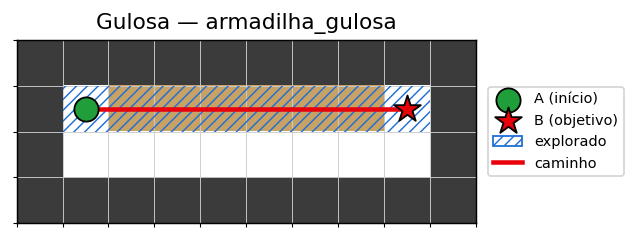
</p>

GIFs:
[(exemplo)](figuras/parte2/exemplo_Gulosa.gif) · [(armadilha)](figuras/parte2/armadilha_gulosa_Gulosa.gif)

**5. A\* — equilíbrio entre qualidade e eficiência.** Une otimalidade e
eficiência: custo ótimo (9) expandindo menos nós que a UCS (10 vs 14).

<p align="center">
  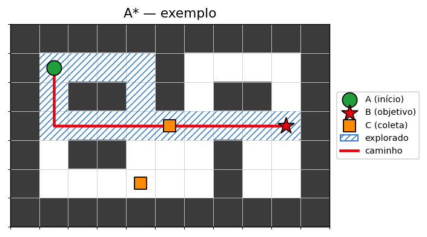
  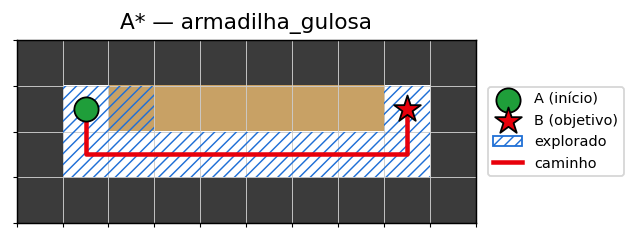
</p>

GIFs:
[(exemplo)](figuras/parte2/exemplo_Aestrela.gif) · [(armadilha)](figuras/parte2/armadilha_gulosa_Aestrela.gif)

**6. Heurística de Manhattan — admissível.** Nunca superestima o custo restante (o menor custo por passo é 1), o que **garante a otimalidade do A\***.

Para ver a exploração no terminal:
`python experimentos.py mapas/[MAPA].txt --animar`.

## 4. Parte III — Busca local

### 4.1 Modelagem
- **Representação (6.1):** permutação dos pontos de coleta; rota = A → ordem → B.

- **Custo (6.2):** C(s) = d(A, ordem[0]) + Σ d(ordem[i], ordem[i+1]) + d(ordem[-1], B), com d(X,Y) = menor caminho calculado por **A\*** (reaproveitado da Parte II), considerando a lama.

- **Vizinhança (6.4):** inversão de um trecho da ordem (2-opt) — desfaz "cruzamentos" preservando boa parte da sequência.

### 4.2 Resultados (mapa `coletas.txt`, 8 pontos)
Ótimo global por força bruta (8! = 40320) = **32**. 30 execuções por método.

```text
###############
#A   C   ~    #
#  ~   C   ~  #
#   C   ~   C #
# ~   C   ~   #
#      ~   C  #
#   ~   C   ~ #
#    ~   C   B#
###############
```

| Método | Melhor | Pior | Médio | Tempo méd. | Iter. méd. | Sucesso |
|--------|:------:|:----:|:-----:|:----------:|:----------:|:-------:|
| Hill-Climbing             | 32 | 38 | 33.1 | 0.18 ms | 4    | 73%  |
| Simulated Annealing       | 32 | 32 | 32.0 | 6.32 ms | 2297 | 100% |
| Algoritmo Genético (bônus)| 32 | 32 | 32.0 | 38.6 ms | 100  | 100% |

A figura a seguir mostra a **rota ótima** (custo 32) desenhada no mapa: o agente
sai de `A`, visita todos os pontos de coleta `C` (laranja) na ordem que minimiza
o custo total e termina em `B`. É essa permutação que os três métodos procuram —
o desafio é achá-la entre as 8! = 40320 ordens possíveis.

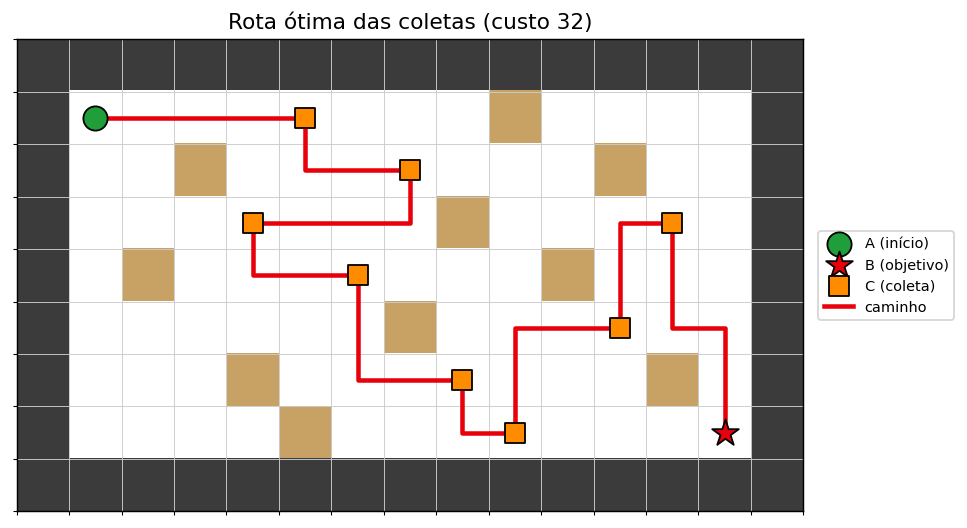

<br>

O gráfico abaixo mostra a evolução do **melhor custo encontrado ao longo das
iterações**. Contraste: o
Hill-Climbing despenca quase verticalmente e estaciona em poucas iterações
(converge rápido, mas arrisca parar em um mínimo local), enquanto o Simulated
Annealing desce em "degraus" — cada patamar é uma melhora aceita — e só atinge
o ótimo (32) por volta da iteração 770, graças à aceitação ocasional de pioras.


O Algoritmo Genético (bônus) tem dinâmica distinta: o eixo X é a **geração**, não
a iteração individual. O melhor custo da população cai rapidamente nas primeiras
gerações e estabiliza no ótimo (32) por volta da geração 7, permanecendo estável
até o fim por causa do elitismo (a melhor solução nunca é perdida).


**Sensibilidade do SA (taxa de sucesso em atingir o ótimo):**

| Temp. inicial | Resfr. 0.90 | Resfr. 0.99 | Resfr. 0.999 |
|:-------------:|:-----------:|:-----------:|:------------:|
| 1     | 53% | 100% | 100% |
| 10    | 67% | 100% | 100% |
| 100   | 70% | 100% | 100% |
| 1000  | 70% | 100% | 100% |

### 4.3 Análise (seção 6.6)
1. **Hill-Climbing fica preso em mínimo local** (sucesso 73%; pior 38 vs ótimo 32).
2. **Simulated Annealing** encontra soluções melhores (100%), aceitando pioras
   com probabilidade exp(−Δ/T) para escapar dos mínimos.
3. **Temperatura inicial:** efeito secundário; só ajuda quando o resfriamento é
   rápido (com 0.90, subir T₀ de 1 para 100 elevou o sucesso de 53% para 70%).
4. **Taxa de resfriamento:** fator dominante; rápida (0.90) → 53–70%; lenta
   (0.99/0.999) → 100%, ao custo de mais iterações.
5. A busca local **não** encontrou sempre o ótimo (HC não; SA sim, se bem
   parametrizado). Em geral não há garantia — aqui confirmamos por força bruta.
6. **Compromisso tempo × qualidade:** HC é ~35× mais rápido porém pior; SA é
   lento e ótimo. Uma alternativa barata é HC com vários reinícios aleatórios.

**Bônus — Algoritmo Genético** (`parte3_local/genetico.py`): abordagem
populacional com seleção por torneio, cruzamento por ordem (OX), mutação por
troca e elitismo. Atingiu o ótimo (32) em 100% das execuções, convergindo por
volta da geração 7, mas é o mais caro em tempo (~38.6 ms) por avaliar a
população inteira a cada geração.

## 5. Parte IV — Busca online

### 5.1 Estratégia e premissas
**Replanning A\*** (Opção A): mapa interno começa todo `?`; a cada passo o agente
percebe a vizinhança (raio 1), atualiza o mapa, roda A* assumindo o desconhecido
como livre, anda **um** passo e replaneja. O agente conhece o tamanho do mapa e
as posições de início e objetivo, mas **não** as paredes.

### 5.2 Resultados

Os mapas abaixo são a verdade de campo (o agente *não* a enxerga de início — só
o tamanho e as posições de `A` e `B`).

**Mapa `exemplo.txt`** (mesmo da Parte II):

```text
###########
#A   #    #
# ## # ## #
#    C   B#
# ##   #  #
#   C  #  #
###########
```

**Mapa `online_armadilha.txt`:**

```text
#######
#A    #
# ### #
# ### #
# ### #
##### #
#     #
#B#####
```

| Mapa | Sucesso | Movimentos | Custo real | Reveladas | Revisitadas | Replanej. | Ótimo offline | Razão |
|------|:-------:|:----------:|:----------:|:---------:|:-----------:|:---------:|:-------------:|:-----:|
| `exemplo.txt`          | sim | 10 | 10 | 34 | 0 | 10 | 10 | **1.00** |
| `online_armadilha.txt` | sim | 20 | 20 | 50 | 3 | 20 | 14 | **1.43** |

A figura mostra o **mapa interno** ao final da execução em `online_armadilha.txt`:
o terreno em cinza-claro nunca foi revelado (`?`), e a linha vermelha é a
trajetória real. Dá para ver o agente descer reto pela suposição otimista,
bater num **beco sem saída** e ter de voltar para contornar — é esse desvio que
eleva a razão online/offline a 1.43. O GIF passo a passo (revelando o mapa a cada
movimento) está em `docs/figuras/parte4/online.gif`; ao vivo:
`python experimentos_online.py mapas/online_armadilha.txt --animar`.

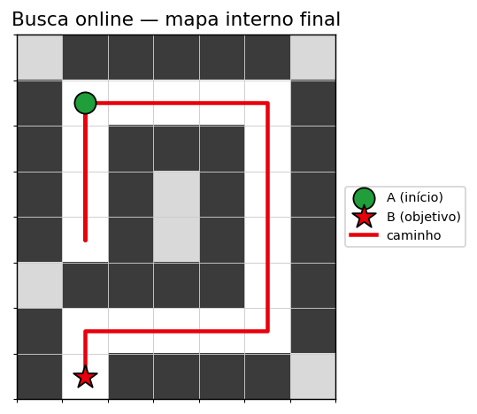

### 5.3 Análise (seção 7.5)
1. **Decisões subótimas** acontecem quando a suposição otimista falha: no
   `armadilha` o agente desceu reto num beco e teve de contornar (razão 1.43);
   no `exemplo` a suposição coincidiu (razão 1.00).
2. **Faltava** ao agente a localização das paredes além do raio de percepção.
3. O **mapa interno converge só parcialmente** (células fora da rota ficam `?`):
   o agente constrói um modelo suficiente para chegar, não completo.
4. **Revisitas** são poucas e concentradas nos backtrackings (0 e 3).
5. **Melhorar a exploração:** aumentar o raio de percepção, supor o desconhecido
   menos otimista, memorizar becos, usar replanejamento incremental (D* Lite).
6. **Diferença para a busca clássica:** a clássica planeja uma vez com o mapa
   completo; a online intercala perceber → planejar → agir, descobrindo o mapa e
   pagando a razão online/offline ≥ 1 pelo desconhecimento.

## 6. Conclusão comparativa

As três abordagens resolvem o mesmo domínio com compromissos distintos:

- **Busca clássica** (mapa conhecido): com informação completa, o **A\*** é a
  melhor escolha — ótimo e eficiente. BFS/UCS são ótimos em condições
  específicas (passos vs custo), DFS é barata mas fraca, e a Gulosa é rápida
  porém arriscada.
- **Busca local** (otimização da ordem de coleta): quando o espaço de soluções é
  grande demais para busca exaustiva, a busca local entrega boas soluções
  rapidamente. O **Simulated Annealing** supera o Hill-Climbing por escapar de
  mínimos locais, controlando o compromisso tempo × qualidade pela taxa de
  resfriamento. O **Algoritmo Genético** (bônus) também alcança o ótimo, com a
  abordagem populacional ao custo de mais tempo.
- **Busca online** (mapa desconhecido): sem informação completa, o agente paga um
  preço (razão ≥ 1) por descobrir o mapa enquanto age. O **replanning A\***
  reaproveita a busca clássica e mantém esse preço baixo quando o ambiente é
  "benigno", mas sofre com becos não previstos.

O fio condutor é o papel da **informação**: quanto mais o agente sabe de
antemão, mais perto do ótimo ele chega — da otimalidade garantida da busca
clássica, passando pela aproximação controlada da busca local, até o custo
inevitável da exploração na busca online.
